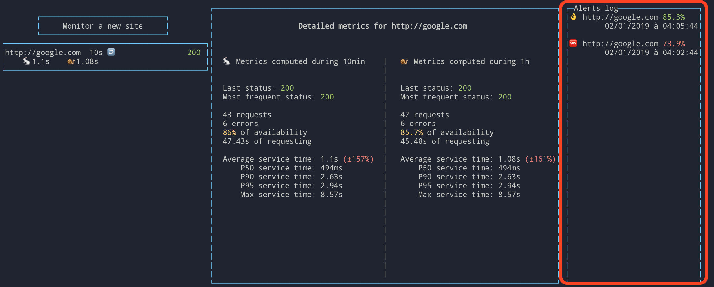

# Server

## Installation

```bash
cd server
yarn # or npm install
```

## Run program

```bash
yarn start:prod # or npm run start:prod
```

If you want to run the server and to restart it at every changes

```bash
yarn start # or npm run start
```

## Test

```bash
yarn test # or npm run test
```

## API / GraphIQL

The API we expose is a [GraphQL](https://graphql.org/) API made with [Apollo](https://www.apollographql.com/).

You can play with this API on an interactive UI at http://localhost:4000/graphiql


# Terminal Client

## Installation

```bash
cd terminal-client
yarn # or npm install
```

# Run program

Commands:

- `yarn start:prod`: build and start the application
- `yarn start`: build and start the application at each file change
- `yarn debug`: just like `yarn start` but start a node debugger

## Debugger


Once you run `yarn debug`, open `Chrome` on http://localhost:9229/, then open your developer panel and click on the NodeJS icon.

# FAQ

## Why did you split your code into 2 different projects?

Currently, there's only a client terminal, but if we wanted to add a client that runs on a browser, we just have to create a new client that performs requests on the back-end and we don't have to re-implement the entire logic / data consistency.

## Why did use GraphQL instead of a regular REST-API?

I find graphql easier to use. And with Apollo, we have access to this GraphIQL panel that allows us to test every requests.

Furthermore, with GraphQL, you have every requests that are available in RESTful API and you have a websocket server right out of the box (and as we're dealing with alerts in this project, I needed bidirectional requests).

## Why did you code your Back-End in NodeJS?

JavaScript is the language I'm most comfortable with. And Apollo is implemented in TypeScript.

## Why did you use react-blessed for the UI?

First, blessed is the only library that I found that allows us to create a full UI within a terminal without to much trouble.

But when you want to update an item of the UI, you have to call `item.render()` on every items, which can be a bit tedious.

As I've already done several websites, I knew that without ReactJS (or any good libraries), create complete UI is a bit verbose (and I'm already used to ReactJS)

And finally, Apollo has a really implementation in ReactJS.

# Interface

## Monitor a new site


To start monitoring a new site, click on the top left button "Monitor a new site", then fill-out the url and interval between two requests.

Once you've added this site, you should see this:


On the left, there are every site you're monitoring, in the middle, the details on the last metrics computed for this website, and on the right there are the alerts.

## Detailed metrics

To visualize the detailed metrics, you just have to click on website in the left panel.


Then you'll see 2 columns: the one on the left contains metrics computed during the last 10 minutes, and the one on the right during the past hour.

## Alerts

When the availability of a website if bellow 80% (and stays bellow 80% for at least 2min), an alert will be sent and it will only be resolved if the availability is over 80% for at least 2min.



# UI improvements

Currently, columns aren't scrollable, so if you want to monitor many websites, you won't be able to see all of those.

That's the same for the alerts. And as I haven't figure out a way to scroll within a column but I wanted to be able to see the most recent alerts, alerts are displayed from the most recent to the oldest.
